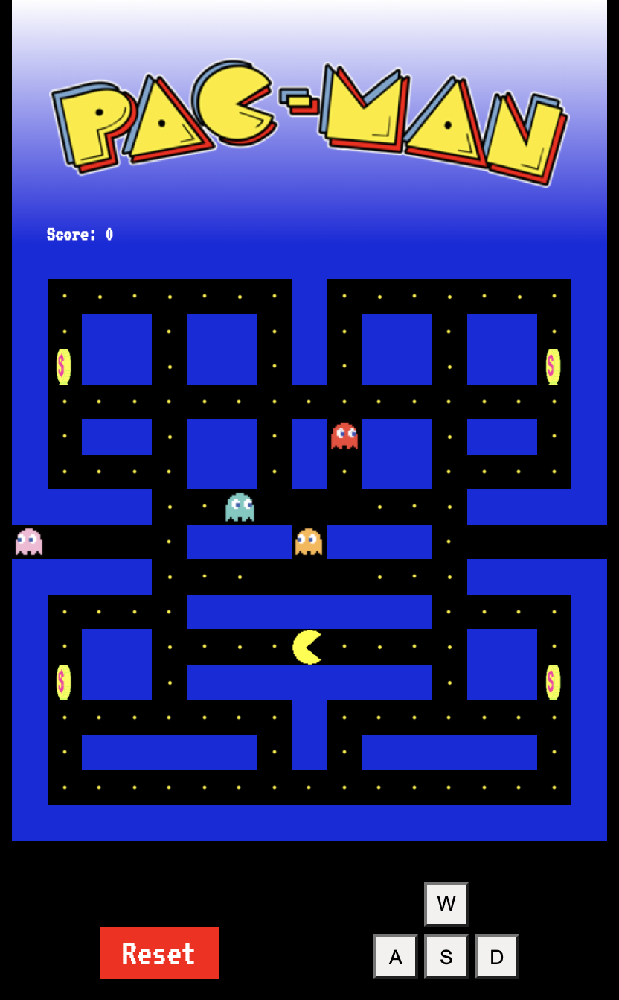

###  General Assembly, Software Engineering Immersive
# Pacman

## Overview
Pacman was my first ever front-end development project, produced as a part of a General Assemebly Immersive Software Engineering bootcamp.

My task was to create a grid-based game rendered in the browser that utilised 'vanilla' JavaScript, HTML and CSS.

Given a list of options from GA, I chose to re-create the classic game **Pac-Man**. I chose to stick to the retro styling of the classic pacman game, sticking to the original pacman/ghost images and the neon style maze.

The project was to consolidate my beginners' knowledge of JavaScript and interacting with the DOM that I had learn't over the first 3 weeks of the course

You can play the game [here](https://jacobaston.github.io/project-1/)

## The Brief 

- **Render a game in the browser**
- **Design logic for winning & visually display a winning message**
- **Include separate HTML / CSS / JavaScript files**
- Stick with **KISS (Keep It Simple Stupid)** and **DRY (Don't Repeat Yourself)** principles
- Use **Javascript** for **DOM manipulation**
- **Deploy your game online**, where the rest of the world can access it
- Use **semantic markup** for HTML and CSS (adhere to best practices)

## The Technologies used 

- HTML5
- CSS3
- JavaScript (ES6)
- Git and GitHub
- Google Fonts

## The Approach



### The Grid

The game is built using a grid. A 17 x 17 square is created using JavaScript. HTML divs are created using a for loop and appended as children of the grid, then stored in an array called 'cells'.

 ```js
const grid = document.querySelector('.grid')

const width = 17 
const cells = []
 
for (let index = 0; index < width ** 2; index++) {
  const cell = document.createElement('div')
  cell.classList.add('cell')
  grid.appendChild(cell)
  cells.push(cell)
  cell.innerHTML = index
}
 ```
 The walls, food and the special coins were then rendered to the grid using an array of grid indicies, then looping through the arrays to match the corrosponding index on the grid.
 
 ```js
 const block = Array.from(document.querySelectorAll('div'))

 // Render walls
 for (let i = 0; i < walls.length; i++) {
  for (let j = 0; j < cells.length; j++) {
    if (walls[i] === Number(cells[j].innerHTML)) {
      block[j].classList.add('wall')
    }
  }
}

// Render food
for (let i = 0; i < food.length; i++) {
  for (let j = 0; j < cells.length; j++) {
    if (food[i] === Number(cells[j].innerHTML)) {
      block[j].classList.add('food')
    }
  }
}

// Render special coins
for (let i = 0; i < cells.length; i++) {
  if (Number(cells[i].innerHTML) === 52 || Number(cells[i].innerHTML) === 66 || Number(cells[i].innerHTML) === 205 || Number(cells[i].innerHTML) === 219) {
    block[i].classList.add('coin')
  }
}
 ```
## Event listeners

In order to move pacman around the board event listeners were used. The decision was made to opt for keycodes in order to improve accessibility and the use of international keyboards.

Within the event listeners boundry conditions have been added to prevent pacman from being able to pass through any of the maze walls.

Futher event listens were also added to the 'W' 'A' 'S' 'D' buttons on the page in order to make the game mobile friendly.

```js
function moveEvent(event) {
  const key = event.keyCode

  if ((key === 68 || key === 39) && !((pacMan + 1) % width === 0) && !(walls.includes(pacMan + 1))) {
    removeFood()
    special()
    removeRecurrence()
    pacMan += 1
    cells[pacMan].classList.add('pacmanRight')
  } else if ((key === 65 || key === 37) && !(pacMan % width === 0) && !(walls.includes(pacMan - 1))) {
    removeFood()
    special()
    removeRecurrence()
    pacMan -= 1
    cells[pacMan].classList.add('pacmanLeft')
  } else if ((key === 83 || key === 40) && !(pacMan + width >= width ** 2) && !(walls.includes(pacMan + 17))) {
    removeFood()
    special()
    removeRecurrence()
    pacMan += width
    cells[pacMan].classList.add('pacmanDown')
  } else if ((key === 87 || key === 38) && !(pacMan < width) && !(walls.includes(pacMan - 17))) {
    removeFood()
    special()
    removeRecurrence()
    pacMan -= width
    cells[pacMan].classList.add('pacmanUp')
  }
}

document.addEventListener('keydown', moveEvent)
 ```
 
## Ghost movement

- A single function is used to determine each ghost's movement. As in the original game, ghosts will look to move closer to pacman as they chase him around the board. 
  - The function starts by grabbing the current position of all the ghosts and pacman, then stores these in an array
  - Once the coordinates have been obtained two further functions within the main function compare the positions on the X & Y axis
  - A interval timer is then added in order to call the comparison functions for pacman and the ghosts, checking the positions every .25 of a second. If the ghost eventually finds pacman the game will then end 

```js
// Random movement of ghosts
function getCoordinates(index) {
  return [index % width, Math.floor(index / width)]
}

function moveGhost(ghost, color) {
  const movement = [+1, + width, -1, - width]
  let direction = 1

  const [ghostX, ghostY] = getCoordinates(ghost)
  const [pacManX, pacManY] = getCoordinates(pacMan)
  const [ghostNextX, ghostNextY] = getCoordinates(ghost + direction)

  function isXCoordCloser() {
    if ((ghostNextX - pacManX) > (ghostX - pacManX)) {
      return true
    } else return false
  }

  function isYCoordCloser() {
    if ((ghostNextY - pacManY) > (ghostY - pacManY)) {
      return true
    } else return false
  }

  ghostimerId = setInterval(function () {
    if (!cells[ghost + direction].classList.contains('wall')) {
      cells[ghost].classList.remove(color)

      if (isXCoordCloser() || isYCoordCloser()) {
        ghost += direction
        cells[ghost].classList.add(color)
        direction = movement[Math.floor(Math.random() * movement.length)]
      } else {
        cells[ghost].classList.add(color)
        direction = movement[Math.floor(Math.random() * movement.length)]
      }
      cells[ghost].classList.add(color)
    } else direction = movement[Math.floor(Math.random() * movement.length)]

    if (cells[ghost].classList.contains('pacmanRight') || cells[ghost].classList.contains('pacmanLeft') || cells[ghost].classList.contains('pacmanUp') || cells[ghost].classList.contains('pacmanDown')) {
      lose.innerHTML = `Game Over! You scored ${points.innerHTML} points`
      clearIntervals()
      document.removeEventListener('keydown', moveEvent)
      right.removeEventListener('click', rightEvent)
      up.removeEventListener('click', upEvent)
      down.removeEventListener('click', downEvent)
      left.removeEventListener('click', leftEvent)
    }
  }, 250)
}
 ```
 
## Challenges

- This was my first front-end JavaScript project and assembling all of my knowledge on arrays, control flow, functions and intervals and applying them to an entirely blank canvas for the first time was without doubt the biggest challenge faced. In places, the code is lengthy and a little unwieldy, but I have deliberately left much of it like this as way of referencing my ability and understanding at the time of creation (the project was set with a one-week timeframe).

- Moving the ghosts in a semi intelligent way was the single biggest technical challenge. It took me a little while to understand how to correctly get the ghosts coordinates and to then compare these to the coordinates of pacman.

## Potential future features

- If I were to create this game again from the begining I would look to incorporate a Breadth-First-Search algorithm in order to make the ghosts move in a more intelligent way. This would make the game run much more smoothly and challenging for the user

- Make the ghosts edible for a set period of time once the special coins have been eaten. This isn't to much of a stretch goal and could quite easily be incorporated within the code I already have

- Adding new levels with increased difficulty once a player completes a maze. This could either come in the form of increased ghost speed or more challenging mazes

## Lessons learned

- Design mobile first. I only added the mobile styling to the game once it was complete on a desktop. Now that over 55% of web traffic is now done on a mobile device this would make future projects much faster to plan and complete

- Plan better. I have a habit of wanting to get stuck stright into the code before having a detailed plan laid out. For future projects I intend to have a comprehensive plan in place that includes pseudo code before I diving in.
